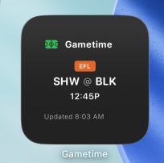
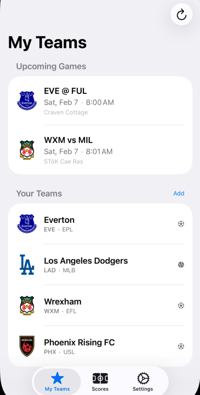
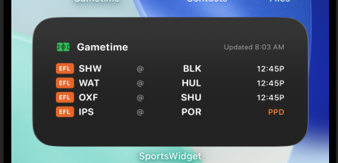
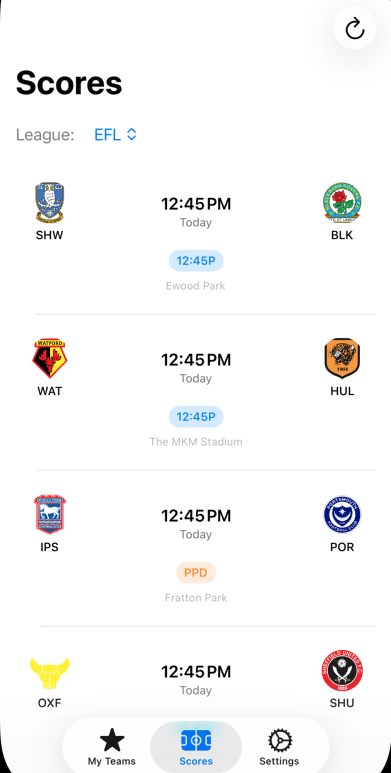

# SportsWidget

An iOS home screen widget that displays upcoming games, live scores, and final results for your favorite sports teams. Built with SwiftUI and WidgetKit.

## Features

### Home Screen Widget
- **Small Widget**: Shows the next upcoming game for your favorite teams
- **Medium Widget**: Displays up to 4 games with compact scorebug format
- **Live Scores**: Updates every 15 minutes with current scores and game status
- **Smart Prioritization**: In-progress games shown first, then scheduled, then completed
- **Game Day Persistence**: Completed game scores remain visible until midnight

### Companion App
- **My Teams Tab**: View your selected teams and their upcoming games
- **Scores Tab**: Full league scoreboard with all games for the day
- **Team Selection**: Easy multi-select from all supported leagues
- **Pull-to-Refresh**: Manual refresh for immediate updates
- **Deep Links**: Tap widget to open relevant game in the app

## Supported Leagues

| League | Sport |
|--------|-------|
| NBA | Basketball |
| NFL | Football |
| MLB | Baseball |
| NHL | Hockey |
| EPL (English Premier League) | Soccer |
| EFL Championship | Soccer |
| USL Championship | Soccer |

## Screenshots

<!-- Add screenshots here -->
| Widget | Companion App |
|--------|---------------|
|  |  |
|  |  |

## Requirements

- iOS 16.0+
- Xcode 15.0+
- Swift 5.9+

## Installation

1. Clone the repository:
   ```bash
   git clone https://github.com/yourusername/SportsWidget.git
   ```

2. Open the project in Xcode:
   ```bash
   cd SportsWidget
   open SportsWidget.xcodeproj
   ```

3. Configure signing:
   - Select the project in the navigator
   - For both `SportsWidget` and `SportsWidgetExtension` targets:
     - Set your development team
     - Update the bundle identifier if needed

4. Configure App Groups:
   - Both targets use the App Group `group.com.sportswidget.shared`
   - Update this in the project settings if you change the bundle identifier

5. Build and run on your device or simulator

## Adding the Widget

1. Long-press on your home screen
2. Tap the **+** button in the top-left corner
3. Search for "Sports Schedule"
4. Choose Small or Medium size
5. Tap "Add Widget"

## Architecture

```
SportsWidget/
├── SportsWidget/                    # Companion app
│   ├── ContentView.swift            # Main TabView (My Teams + Scores)
│   ├── Models/
│   │   ├── Team.swift               # Team data with logo URLs
│   │   ├── Game.swift               # Game data with scores
│   │   └── ScheduleEntry.swift      # Widget timeline entry
│   └── Services/
│       ├── ESPNAPIClient.swift      # ESPN API integration
│       └── DataCache.swift          # Local data persistence
│
├── SportsWidgetExtension/           # Widget extension
│   ├── SportsWidgetExtension.swift  # TimelineProvider
│   ├── Views/
│   │   ├── SmallWidgetView.swift
│   │   └── MediumWidgetView.swift
│   └── (shared models & services)
│
└── docs/
    └── sports_widget_spec.md        # Technical specification
```

## Tech Stack

- **SwiftUI** - Declarative UI framework
- **WidgetKit** - Home screen widget framework
- **Swift Concurrency** - async/await for networking
- **App Groups** - Shared data between app and widget
- **ESPN API** - Sports data (unofficial, no API key required)

## API

This app uses the unofficial ESPN API for sports data:

```
https://site.api.espn.com/apis/site/v2/sports/{sport}/{league}/scoreboard
```

**Examples:**
- NBA: `/basketball/nba/scoreboard`
- NFL: `/football/nfl/scoreboard`
- EPL: `/soccer/eng.1/scoreboard`

The API is free to use with no authentication required. Please be respectful with request frequency.

## Widget Update Schedule

- Widgets refresh every **15 minutes** to provide timely score updates
- iOS may throttle updates based on system conditions and battery
- The widget shows cached data when offline or if API requests fail

## Game Status Display

| Status | Widget Display | Color |
|--------|---------------|-------|
| Scheduled | Time (e.g., "7:30P") | Secondary |
| In Progress | Period (e.g., "Q3", "2nd") | Green |
| Completed | "FINAL" | Secondary |
| Postponed | "PPD" | Orange |
| Canceled | "CAN" | Orange |

### Sport-Specific Period Formatting

- **NBA/NFL**: Q1, Q2, Q3, Q4, OT
- **NHL**: 1st, 2nd, 3rd, OT
- **MLB**: ↑7, ↓7 (arrows for top/bottom of inning)
- **Soccer**: 1st, 2nd, ET

## Contributing

Contributions are welcome! Please feel free to submit a Pull Request.

1. Fork the repository
2. Create your feature branch (`git checkout -b feature/AmazingFeature`)
3. Commit your changes (`git commit -m 'Add some AmazingFeature'`)
4. Push to the branch (`git push origin feature/AmazingFeature`)
5. Open a Pull Request

## Known Limitations

- Widget refresh is controlled by iOS and may not always occur exactly every 15 minutes
- Some team logos (especially smaller leagues) may not be available from ESPN
- The ESPN API is unofficial and may change without notice

## License

This project is licensed under the MIT License - see the [LICENSE](LICENSE) file for details.

## Acknowledgments

- Sports data provided by [ESPN](https://www.espn.com/)
- Built with guidance from [Claude Code](https://claude.ai/claude-code)

---

**Note**: This app is not affiliated with, endorsed by, or connected to ESPN or any sports league. All team names, logos, and related marks are trademarks of their respective owners.
